# Walkthru Earth AI — Architecture & Workflows

Complete technical architecture of the AI urban intelligence platform. All diagrams use Mermaid.

---

## Table of Contents

- [System Overview](#system-overview)
- [Technology Stack](#technology-stack)
- [Application Structure](#application-structure)
- [Data Flow — The queryId Pattern](#data-flow--the-queryid-pattern)
- [AI Tool Workflow](#ai-tool-workflow)
- [Component Rendering Pipeline](#component-rendering-pipeline)
- [GeoArrow Zero-Copy Rendering](#geoarrow-zero-copy-rendering)
- [Geometry Auto-Detection](#geometry-auto-detection)
- [Cross-Filter Bus](#cross-filter-bus)
- [Dashboard Canvas Layout](#dashboard-canvas-layout)
- [Thread Lifecycle](#thread-lifecycle)
- [Tambo SDK Integration](#tambo-sdk-integration)
- [Data Services Architecture](#data-services-architecture)
- [Weather Forecast Workflow](#weather-forecast-workflow)
- [Cross-Index Analysis Workflow](#cross-index-analysis-workflow)
- [ArcGIS FeatureServer Workflow](#arcgis-featureserver-workflow)
- [Settings & Persistence](#settings--persistence)
- [Theme System](#theme-system)
- [Mobile Architecture](#mobile-architecture)
- [Geo-IP Personalization](#geo-ip-personalization)
- [Error Recovery](#error-recovery)

---

## System Overview

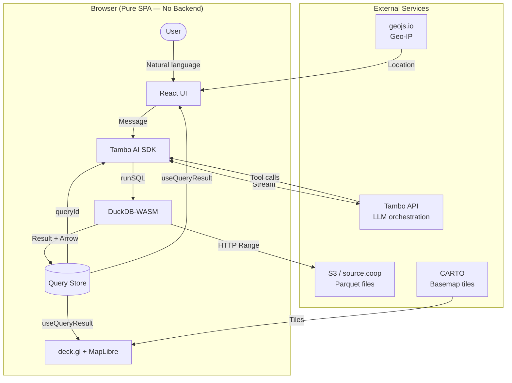
```mermaid
graph TB
    subgraph Browser["Browser (Pure SPA — No Backend)"]
        User([User])
        UI[React UI]
        Tambo[Tambo AI SDK]
        DuckDB[DuckDB-WASM]
        DeckGL[deck.gl + MapLibre]
        Store[(Query Store)]
    end

    subgraph External["External Services"]
        TamboAPI[Tambo API<br/>LLM orchestration]
        S3[S3 / source.coop<br/>Parquet files]
        GeoJS[geojs.io<br/>Geo-IP]
        CARTO[CARTO<br/>Basemap tiles]
    end

    User -->|Natural language| UI
    UI -->|Message| Tambo
    Tambo <-->|Stream| TamboAPI
    TamboAPI -->|Tool calls| Tambo
    Tambo -->|runSQL| DuckDB
    DuckDB -->|HTTP Range| S3
    DuckDB -->|Result + Arrow| Store
    Store -->|queryId| Tambo
    Store -->|useQueryResult| DeckGL
    Store -->|useQueryResult| UI
    GeoJS -->|Location| UI
    CARTO -->|Tiles| DeckGL
```

The entire computation runs in the browser. No backend server exists. DuckDB-WASM executes SQL against remote Parquet files on S3 via HTTP range requests. The LLM only sees a `queryId` string (~10 tokens) — never the actual data.

---

## Technology Stack

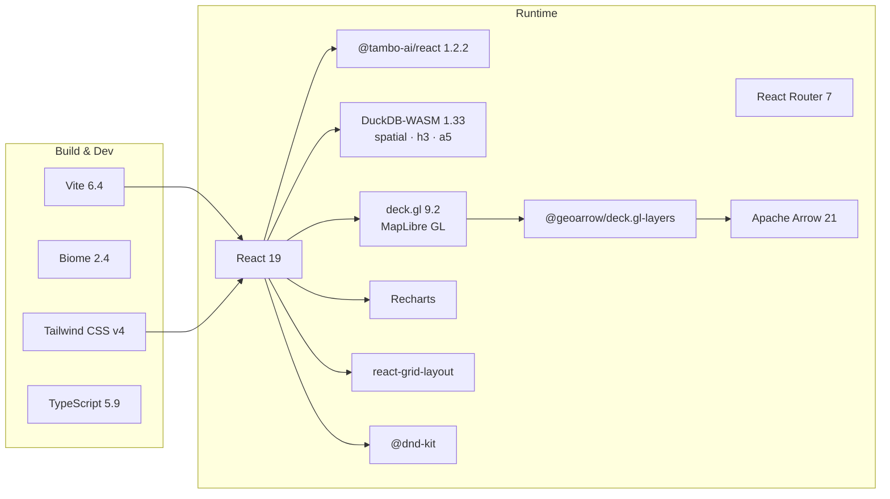
```mermaid
graph LR
    subgraph Build["Build & Dev"]
        Vite[Vite 6.4]
        Biome[Biome 2.4]
        TW[Tailwind CSS v4]
        TS[TypeScript 5.9]
    end

    subgraph Runtime["Runtime"]
        React[React 19]
        RR[React Router 7]
        TamboSDK["@tambo-ai/react 1.2.2"]
        DDBW["DuckDB-WASM 1.33<br/>spatial · h3 · a5"]
        Deck["deck.gl 9.2<br/>MapLibre GL"]
        GA["@geoarrow/deck.gl-layers"]
        Arrow["Apache Arrow 21"]
        RC[Recharts]
        RGL[react-grid-layout]
        DnD["@dnd-kit"]
    end

    Vite --> React
    TW --> React
    React --> TamboSDK
    React --> DDBW
    React --> Deck
    Deck --> GA
    GA --> Arrow
    React --> RC
    React --> RGL
    React --> DnD
```

---

## Application Structure


```mermaid
graph TB
    subgraph Pages["Pages (src/app/)"]
        Landing["/ — Landing"]
        Chat["/chat — Chat"]
        Explore["/explore — Explorer"]
        Inter["/interactables — Demo"]
    end

    subgraph Components["Components (src/components/)"]
        subgraph Tambo_Comp["tambo/ — AI Components"]
            GeoMap[GeoMap]
            Graph[Graph]
            DataTable[DataTable]
            StatsCard[StatsCard]
            StatsGrid[StatsGrid]
            InsightCard[InsightCard]
            DatasetCard[DatasetCard]
            QueryDisplay[QueryDisplay]
            DataCard[DataCard]
            ObjexViewer[ObjexViewer]
        end
        subgraph Chat_Comp["tambo/ — Chat"]
            MsgInput[MessageInput]
            MsgThread[MessageThreadFull]
            ThreadContent_C[ThreadContent]
            Suggestions[MessageSuggestions]
            DashCanvas[DashboardCanvas]
            ThreadHistory_C[ThreadHistory]
        end
        subgraph UI_Comp["ui/ — Primitives"]
            CardSkel[CardSkeleton]
        end
        Settings_C[SettingsButton]
    end

    subgraph Lib["Lib (src/lib/)"]
        TamboConfig["tambo/ — AI Config"]
        Hooks["Hooks"]
        Storage_L["storage.ts"]
        SettingsStore["settings-store.ts"]
    end

    subgraph Services["Services (src/services/)"]
        DuckDBSvc[duckdb-wasm.ts]
        QStore[query-store.ts]
        Datasets["datasets/ — 9 modules"]
        CrossIdx["cross-indices/ — 11 modules"]
        Resolvers[resolvers.ts]
        Suggest[suggest-analysis.ts]
    end

    Explore --> DashCanvas
    Explore --> MsgInput
    Chat --> MsgThread
    Chat --> MsgInput

    GeoMap --> QStore
    Graph --> QStore
    DataTable --> QStore
    DashCanvas --> GeoMap
    DashCanvas --> Graph
    DashCanvas --> DataTable

    TamboConfig --> DuckDBSvc
    TamboConfig --> Datasets
    TamboConfig --> CrossIdx
```

### File Tree

```
src/
├── app/                              # Pages
│   ├── page.tsx                      # Landing — static, no AI
│   ├── chat/page.tsx                 # Chat — inline components
│   ├── explore/page.tsx              # Explorer — sidebar + dashboard
│   └── interactables/                # Demo page
├── components/
│   ├── tambo/                        # AI-driven components (14 files)
│   │   ├── geo-map.tsx               # Map wrapper (1193 lines)
│   │   ├── geo-map-deckgl.tsx        # deck.gl engine (1149 lines)
│   │   ├── graph.tsx                 # Recharts (760 lines)
│   │   ├── data-table.tsx            # Paginated table (384 lines)
│   │   ├── dashboard-canvas.tsx      # Panel layout engine
│   │   ├── message-input.tsx         # Chat input (1169 lines)
│   │   ├── message.tsx               # Message renderer (841 lines)
│   │   └── ...                       # 20+ more components
│   └── ui/                           # Primitives (CardSkeleton, etc.)
├── lib/
│   ├── tambo/                        # Modular AI configuration
│   │   ├── tools/                    # 8 tool registrations
│   │   ├── components/               # 11 component registrations
│   │   ├── context/                  # AI behavior, DuckDB rules, tips
│   │   └── suggestions.ts            # Geo-personalized chips
│   ├── storage.ts                    # Safe localStorage helpers
│   ├── settings-store.ts             # Theme + queryLimit store
│   ├── use-copy-to-clipboard.ts      # Clipboard hook
│   ├── use-page-bootstrap.ts         # Shared page setup
│   ├── use-geo-ip.ts                 # IP geolocation
│   └── use-anonymous-user-key.ts     # Stable user ID
└── services/
    ├── duckdb-wasm.ts                # DuckDB singleton + query execution
    ├── query-store.ts                # Reactive store + cross-filter bus
    ├── resolvers.ts                  # Weather date + Overture release
    ├── suggest-analysis.ts           # NL keyword routing
    ├── datasets/                     # 9 dataset definitions
    └── cross-indices/                # 11 cross-index definitions
```

---

## Data Flow — The queryId Pattern

The core innovation: AI never sees the data. Only a tiny `queryId` string (~10 tokens) bridges the LLM and components.

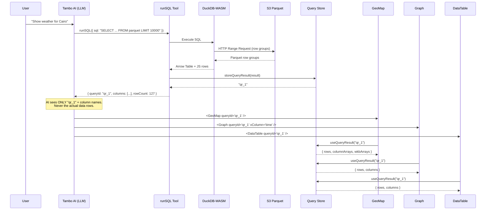
```mermaid
sequenceDiagram
    participant User
    participant AI as Tambo AI (LLM)
    participant Tool as runSQL Tool
    participant DB as DuckDB-WASM
    participant S3 as S3 Parquet
    participant Store as Query Store
    participant Map as GeoMap
    participant Chart as Graph
    participant Table as DataTable

    User->>AI: "Show weather for Cairo"
    AI->>Tool: runSQL({ sql: "SELECT ... FROM parquet LIMIT 10000" })
    Tool->>DB: Execute SQL
    DB->>S3: HTTP Range Request (row groups)
    S3-->>DB: Parquet row groups
    DB-->>Tool: Arrow Table + JS rows
    Tool->>Store: storeQueryResult(result)
    Store-->>Tool: "qr_1"
    Tool-->>AI: { queryId: "qr_1", columns: [...], rowCount: 127 }

    Note over AI: AI sees ONLY "qr_1" + column names.<br/>Never the actual data rows.

    AI->>Map: <GeoMap queryId="qr_1" />
    AI->>Chart: <Graph queryId="qr_1" xColumn="time" />
    AI->>Table: <DataTable queryId="qr_1" />

    Map->>Store: useQueryResult("qr_1")
    Store-->>Map: { rows, columnArrays, wkbArrays }
    Chart->>Store: useQueryResult("qr_1")
    Store-->>Chart: { rows, columns }
    Table->>Store: useQueryResult("qr_1")
    Store-->>Table: { rows, columns }
```

### Query Store Internals

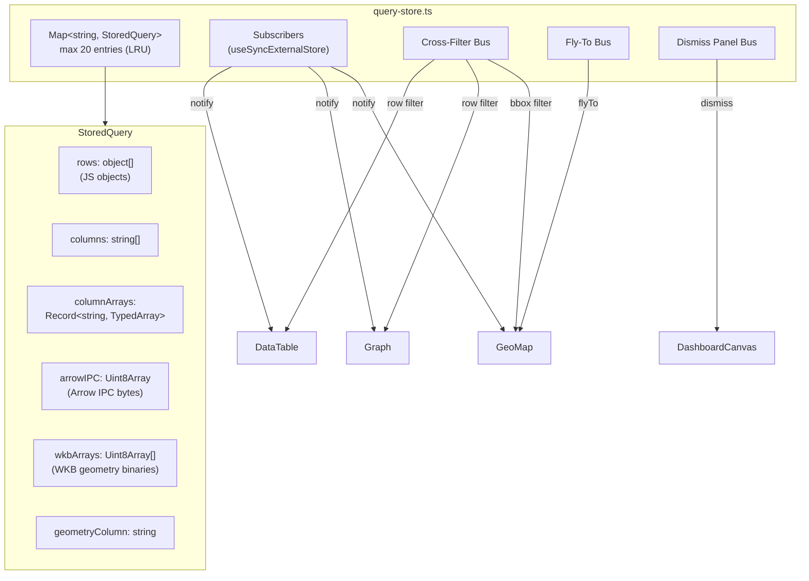
```mermaid
graph TB
    subgraph QueryStore["query-store.ts"]
        Map_S["Map&lt;string, StoredQuery&gt;<br/>max 20 entries (LRU)"]
        Sub["Subscribers<br/>(useSyncExternalStore)"]
        CF["Cross-Filter Bus"]
        FT["Fly-To Bus"]
        DP["Dismiss Panel Bus"]
    end

    subgraph StoredQuery["StoredQuery"]
        rows["rows: object[]<br/>(JS objects)"]
        cols["columns: string[]"]
        colArrays["columnArrays:<br/>Record&lt;string, TypedArray&gt;"]
        arrowIPC["arrowIPC: Uint8Array<br/>(Arrow IPC bytes)"]
        wkbArrays["wkbArrays: Uint8Array[]<br/>(WKB geometry binaries)"]
        geomCol["geometryColumn: string"]
    end

    Map_S --> StoredQuery
    Sub -->|notify| GeoMap_C[GeoMap]
    Sub -->|notify| Graph_C[Graph]
    Sub -->|notify| Table_C[DataTable]

    CF -->|bbox filter| GeoMap_C
    CF -->|row filter| Graph_C
    CF -->|row filter| Table_C

    FT -->|flyTo| GeoMap_C
    DP -->|dismiss| Dashboard[DashboardCanvas]
```

---

## AI Tool Workflow

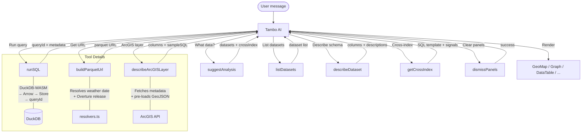
```mermaid
flowchart TB
    User([User message]) --> Tambo[Tambo AI]

    Tambo -->|"What data?"| T1[suggestAnalysis]
    Tambo -->|"List datasets"| T2[listDatasets]
    Tambo -->|"Get URL"| T3[buildParquetUrl]
    Tambo -->|"Describe schema"| T4[describeDataset]
    Tambo -->|"Run query"| T5[runSQL]
    Tambo -->|"Cross-index"| T6[getCrossIndex]
    Tambo -->|"ArcGIS layer"| T7[describeArcGISLayer]
    Tambo -->|"Clear panels"| T8[dismissPanels]

    T1 -->|"datasets + crossIndex"| Tambo
    T2 -->|"dataset list"| Tambo
    T3 -->|"parquet URL"| Tambo
    T4 -->|"columns + descriptions"| Tambo
    T5 -->|"queryId + metadata"| Tambo
    T6 -->|"SQL template + signals"| Tambo
    T7 -->|"columns + sampleSQL"| Tambo
    T8 -->|"success"| Tambo

    Tambo -->|Render| Components[GeoMap / Graph / DataTable / ...]

    subgraph ToolDetails["Tool Details"]
        direction LR
        T5 ---|"DuckDB-WASM<br/>→ Arrow → Store<br/>→ queryId"| DB[(DuckDB)]
        T3 ---|"Resolves weather date<br/>+ Overture release"| Res[resolvers.ts]
        T7 ---|"Fetches metadata<br/>+ pre-loads GeoJSON"| ArcGIS[ArcGIS API]
    end
```

### Tool Call Sequence (typical weather query)

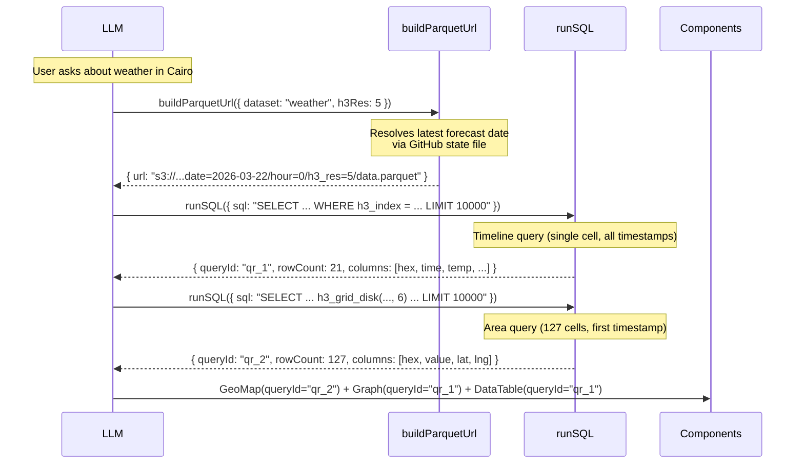
```mermaid
sequenceDiagram
    participant AI as LLM
    participant BPU as buildParquetUrl
    participant SQL as runSQL
    participant Comp as Components

    Note over AI: User asks about weather in Cairo

    AI->>BPU: buildParquetUrl({ dataset: "weather", h3Res: 5 })
    Note over BPU: Resolves latest forecast date<br/>via GitHub state file
    BPU-->>AI: { url: "s3://...date=2026-03-22/hour=0/h3_res=5/data.parquet" }

    AI->>SQL: runSQL({ sql: "SELECT ... WHERE h3_index = ... LIMIT 10000" })
    Note over SQL: Timeline query (single cell, all timestamps)
    SQL-->>AI: { queryId: "qr_1", rowCount: 21, columns: [hex, time, temp, ...] }

    AI->>SQL: runSQL({ sql: "SELECT ... h3_grid_disk(..., 6) ... LIMIT 10000" })
    Note over SQL: Area query (127 cells, first timestamp)
    SQL-->>AI: { queryId: "qr_2", rowCount: 127, columns: [hex, value, lat, lng] }

    AI->>Comp: GeoMap(queryId="qr_2") + Graph(queryId="qr_1") + DataTable(queryId="qr_1")
```

---

## Component Rendering Pipeline

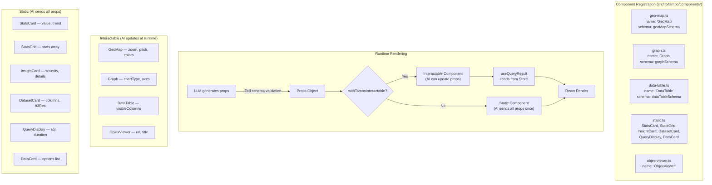
```mermaid
flowchart TB
    subgraph Registration["Component Registration (src/lib/tambo/components/)"]
        GeoMapReg["geo-map.ts<br/>name: 'GeoMap'<br/>schema: geoMapSchema"]
        GraphReg["graph.ts<br/>name: 'Graph'<br/>schema: graphSchema"]
        TableReg["data-table.ts<br/>name: 'DataTable'<br/>schema: dataTableSchema"]
        StaticReg["static.ts<br/>StatsCard, StatsGrid,<br/>InsightCard, DatasetCard,<br/>QueryDisplay, DataCard"]
        ObjexReg["objex-viewer.ts<br/>name: 'ObjexViewer'"]
    end

    subgraph Runtime["Runtime Rendering"]
        AI[LLM generates props] -->|"Zod schema validation"| Props[Props Object]
        Props --> WTI{withTamboInteractable?}
        WTI -->|Yes| Interactable["Interactable Component<br/>(AI can update props)"]
        WTI -->|No| Static["Static Component<br/>(AI sends all props once)"]

        Interactable --> QR[useQueryResult<br/>reads from Store]
        QR --> Render[React Render]

        Static --> Render
    end

    subgraph Interactable_Components["Interactable (AI updates at runtime)"]
        I_Map[GeoMap — zoom, pitch, colors]
        I_Graph[Graph — chartType, axes]
        I_Table[DataTable — visibleColumns]
        I_Objex[ObjexViewer — url, title]
    end

    subgraph Static_Components["Static (AI sends all props)"]
        S_Stats[StatsCard — value, trend]
        S_Grid[StatsGrid — stats array]
        S_Insight[InsightCard — severity, details]
        S_Dataset[DatasetCard — columns, h3Res]
        S_Query[QueryDisplay — sql, duration]
        S_Data[DataCard — options list]
    end
```

### UPDATE vs CREATE NEW Decision

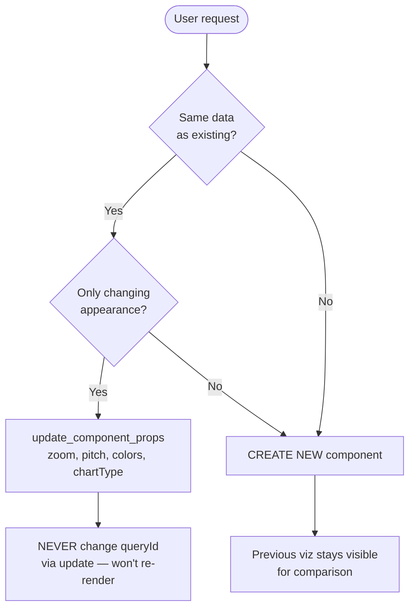
```mermaid
flowchart TD
    Request([User request]) --> SameData{Same data<br/>as existing?}

    SameData -->|Yes| AppearanceOnly{Only changing<br/>appearance?}
    AppearanceOnly -->|Yes| Update["update_component_props<br/>zoom, pitch, colors, chartType"]
    AppearanceOnly -->|No| CreateNew["CREATE NEW component"]

    SameData -->|No| CreateNew

    CreateNew --> Note1["Previous viz stays visible<br/>for comparison"]
    Update --> Note2["NEVER change queryId<br/>via update — won't re-render"]
```

---

## GeoArrow Zero-Copy Rendering

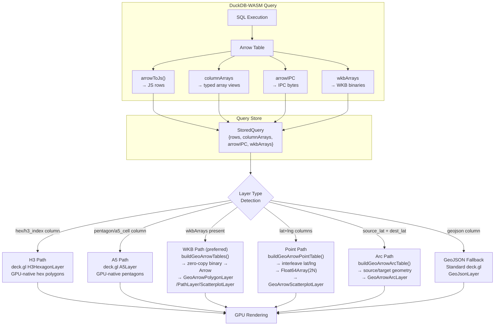
```mermaid
flowchart TB
    subgraph DuckDB["DuckDB-WASM Query"]
        SQL[SQL Execution] --> ArrowTable[Arrow Table]
        ArrowTable --> JS["arrowToJs()<br/>→ JS rows"]
        ArrowTable --> ColArrays["columnArrays<br/>→ typed array views"]
        ArrowTable --> IPC["arrowIPC<br/>→ IPC bytes"]
        ArrowTable --> WKB["wkbArrays<br/>→ WKB binaries"]
    end

    subgraph Store["Query Store"]
        All["StoredQuery<br/>{rows, columnArrays,<br/>arrowIPC, wkbArrays}"]
    end

    JS --> All
    ColArrays --> All
    IPC --> All
    WKB --> All

    All --> Detection{Layer Type<br/>Detection}

    Detection -->|"hex/h3_index column"| H3Path["H3 Path<br/>deck.gl H3HexagonLayer<br/>GPU-native hex polygons"]

    Detection -->|"pentagon/a5_cell column"| A5Path["A5 Path<br/>deck.gl A5Layer<br/>GPU-native pentagons"]

    Detection -->|"wkbArrays present"| WKBPath["WKB Path (preferred)<br/>buildGeoArrowTables()<br/>→ zero-copy binary → Arrow<br/>→ GeoArrowPolygonLayer<br/>/PathLayer/ScatterplotLayer"]

    Detection -->|"lat+lng columns"| PointPath["Point Path<br/>buildGeoArrowPointTable()<br/>→ interleave lat/lng<br/>→ Float64Array(2N)<br/>→ GeoArrowScatterplotLayer"]

    Detection -->|"source_lat + dest_lat"| ArcPath["Arc Path<br/>buildGeoArrowArcTable()<br/>→ source/target geometry<br/>→ GeoArrowArcLayer"]

    Detection -->|"geojson column"| GJPath["GeoJSON Fallback<br/>Standard deck.gl<br/>GeoJsonLayer"]

    H3Path --> GPU[GPU Rendering]
    A5Path --> GPU
    WKBPath --> GPU
    PointPath --> GPU
    ArcPath --> GPU
    GJPath --> GPU
```

### Layer Type Auto-Detection Priority

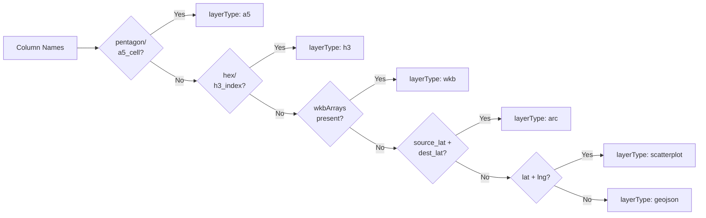
```mermaid
flowchart LR
    Columns[Column Names] --> C1{pentagon/<br/>a5_cell?}
    C1 -->|Yes| A5[layerType: a5]
    C1 -->|No| C2{hex/<br/>h3_index?}
    C2 -->|Yes| H3[layerType: h3]
    C2 -->|No| C3{wkbArrays<br/>present?}
    C3 -->|Yes| WKB_L[layerType: wkb]
    C3 -->|No| C4{source_lat +<br/>dest_lat?}
    C4 -->|Yes| Arc[layerType: arc]
    C4 -->|No| C5{lat + lng?}
    C5 -->|Yes| Scatter[layerType: scatterplot]
    C5 -->|No| GeoJSON_L[layerType: geojson]
```

---

## Geometry Auto-Detection

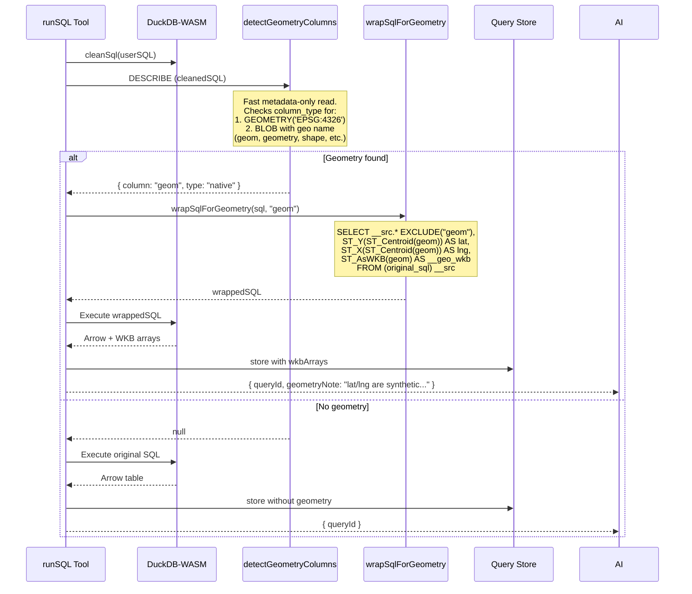
```mermaid
sequenceDiagram
    participant Tool as runSQL Tool
    participant DB as DuckDB-WASM
    participant Detect as detectGeometryColumns
    participant Wrap as wrapSqlForGeometry
    participant Store as Query Store

    Tool->>DB: cleanSql(userSQL)
    Tool->>Detect: DESCRIBE (cleanedSQL)
    Note over Detect: Fast metadata-only read.<br/>Checks column_type for:<br/>1. GEOMETRY('EPSG:4326')<br/>2. BLOB with geo name<br/>(geom, geometry, shape, etc.)

    alt Geometry found
        Detect-->>Tool: { column: "geom", type: "native" }
        Tool->>Wrap: wrapSqlForGeometry(sql, "geom")
        Note over Wrap: SELECT __src.* EXCLUDE("geom"),<br/>ST_Y(ST_Centroid(geom)) AS lat,<br/>ST_X(ST_Centroid(geom)) AS lng,<br/>ST_AsWKB(geom) AS __geo_wkb<br/>FROM (original_sql) __src
        Wrap-->>Tool: wrappedSQL
        Tool->>DB: Execute wrappedSQL
        DB-->>Tool: Arrow + WKB arrays
        Tool->>Store: store with wkbArrays
        Tool-->>AI: { queryId, geometryNote: "lat/lng are synthetic..." }
    else No geometry
        Detect-->>Tool: null
        Tool->>DB: Execute original SQL
        DB-->>Tool: Arrow table
        Tool->>Store: store without geometry
        Tool-->>AI: { queryId }
    end
```

---

## Cross-Filter Bus

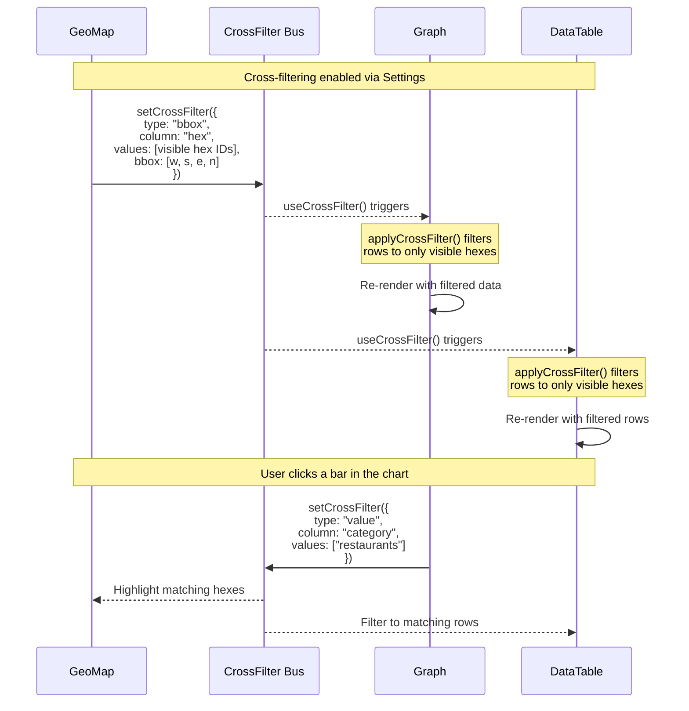
```mermaid
sequenceDiagram
    participant Map as GeoMap
    participant Store as CrossFilter Bus
    participant Graph as Graph
    participant Table as DataTable

    Note over Map,Table: Cross-filtering enabled via Settings

    Map->>Store: setCrossFilter({<br/>  type: "bbox",<br/>  column: "hex",<br/>  values: [visible hex IDs],<br/>  bbox: [w, s, e, n]<br/>})

    Store-->>Graph: useCrossFilter() triggers
    Note over Graph: applyCrossFilter() filters<br/>rows to only visible hexes
    Graph->>Graph: Re-render with filtered data

    Store-->>Table: useCrossFilter() triggers
    Note over Table: applyCrossFilter() filters<br/>rows to only visible hexes
    Table->>Table: Re-render with filtered rows

    Note over Map,Table: User clicks a bar in the chart

    Graph->>Store: setCrossFilter({<br/>  type: "value",<br/>  column: "category",<br/>  values: ["restaurants"]<br/>})

    Store-->>Map: Highlight matching hexes
    Store-->>Table: Filter to matching rows
```

### Fly-To Bus (DataTable → Map)

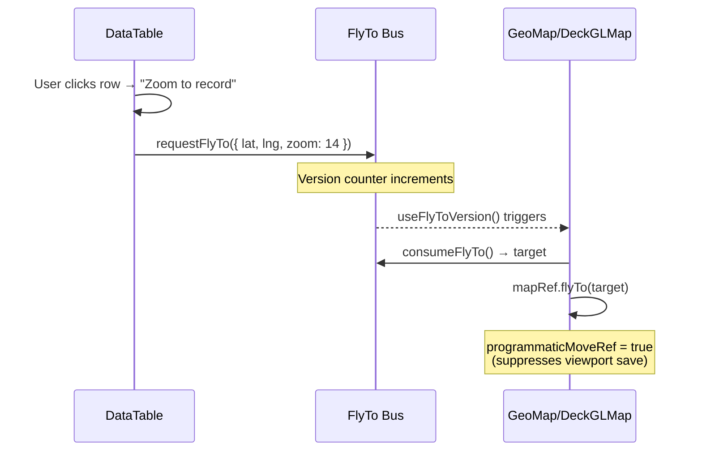
```mermaid
sequenceDiagram
    participant Table as DataTable
    participant Bus as FlyTo Bus
    participant Map as GeoMap/DeckGLMap

    Table->>Table: User clicks row → "Zoom to record"
    Table->>Bus: requestFlyTo({ lat, lng, zoom: 14 })
    Note over Bus: Version counter increments
    Bus-->>Map: useFlyToVersion() triggers
    Map->>Bus: consumeFlyTo() → target
    Map->>Map: mapRef.flyTo(target)
    Note over Map: programmaticMoveRef = true<br/>(suppresses viewport save)
```

---

## Dashboard Canvas Layout

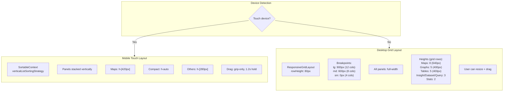
```mermaid
flowchart TB
    subgraph Detection["Device Detection"]
        Touch{Touch device?}
    end

    Touch -->|Yes| Mobile["Mobile Layout<br/>(@dnd-kit sortable)"]
    Touch -->|No| Desktop["Desktop Layout<br/>(react-grid-layout)"]

    subgraph Mobile["Mobile Touch Layout"]
        direction TB
        M_Sort["SortableContext<br/>verticalListSortingStrategy"]
        M_Panels["Panels stacked vertically"]
        M_Map["Maps: h-[420px]"]
        M_Compact["Compact: h-auto"]
        M_Other["Others: h-[280px]"]
        M_Drag["Drag: grip-only, 1.2s hold"]
    end

    subgraph Desktop["Desktop Grid Layout"]
        direction TB
        D_Grid["ResponsiveGridLayout<br/>rowHeight: 80px"]
        D_Break["Breakpoints:<br/>lg: 900px (12 cols)<br/>md: 600px (8 cols)<br/>sm: 0px (4 cols)"]
        D_Full["All panels: full-width"]
        D_Heights["Heights (grid rows):<br/>Maps: 8 (640px)<br/>Graphs: 5 (400px)<br/>Tables: 5 (400px)<br/>Insight/Dataset/Query: 3<br/>Stats: 2"]
        D_Resize["User can resize + drag"]
    end
```

### Panel Ordering Logic

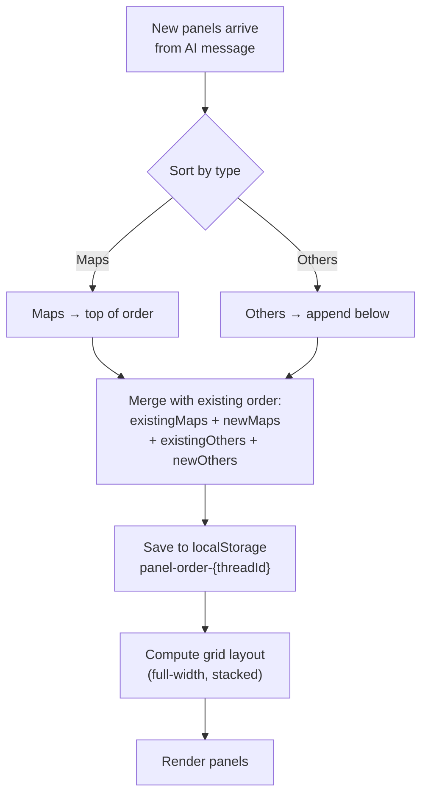
```mermaid
flowchart TD
    NewPanels[New panels arrive<br/>from AI message] --> Sort{Sort by type}
    Sort -->|Maps| MapGroup["Maps → top of order"]
    Sort -->|Others| OtherGroup["Others → append below"]

    MapGroup --> Merge["Merge with existing order:<br/>existingMaps + newMaps<br/>+ existingOthers + newOthers"]
    OtherGroup --> Merge

    Merge --> Persist["Save to localStorage<br/>panel-order-{threadId}"]
    Persist --> Layout["Compute grid layout<br/>(full-width, stacked)"]
    Layout --> Render_P[Render panels]
```

### Panel Lifecycle

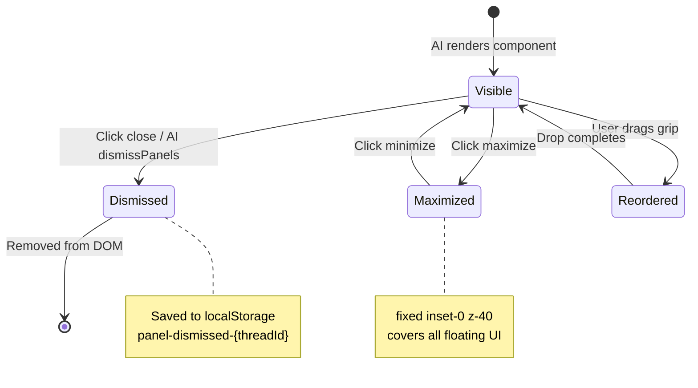
```mermaid
stateDiagram-v2
    [*] --> Visible: AI renders component
    Visible --> Maximized: Click maximize
    Maximized --> Visible: Click minimize
    Visible --> Dismissed: Click close / AI dismissPanels
    Dismissed --> [*]: Removed from DOM
    Visible --> Reordered: User drags grip
    Reordered --> Visible: Drop completes

    note right of Maximized
        fixed inset-0 z-40
        covers all floating UI
    end note

    note right of Dismissed
        Saved to localStorage
        panel-dismissed-{threadId}
    end note
```

---

## Thread Lifecycle

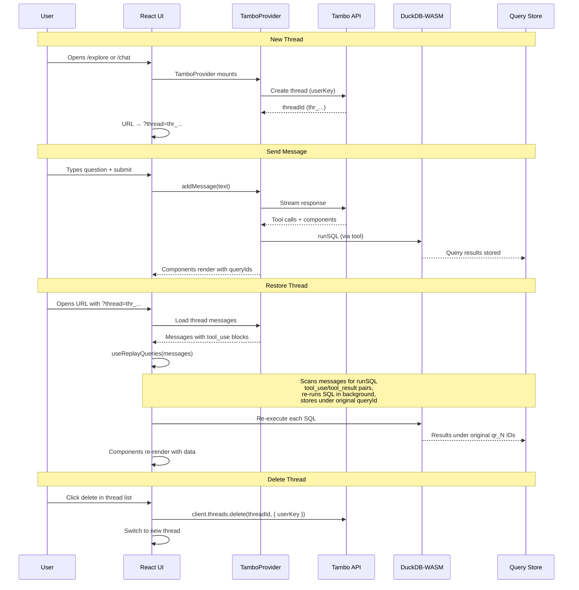
```mermaid
sequenceDiagram
    participant User
    participant UI as React UI
    participant Tambo as TamboProvider
    participant API as Tambo API
    participant DB as DuckDB-WASM
    participant Store as Query Store

    Note over User,Store: New Thread
    User->>UI: Opens /explore or /chat
    UI->>Tambo: TamboProvider mounts
    Tambo->>API: Create thread (userKey)
    API-->>Tambo: threadId (thr_...)
    UI->>UI: URL → ?thread=thr_...

    Note over User,Store: Send Message
    User->>UI: Types question + submit
    UI->>Tambo: addMessage(text)
    Tambo->>API: Stream response
    API-->>Tambo: Tool calls + components
    Tambo->>DB: runSQL (via tool)
    DB-->>Store: Query results stored
    Tambo-->>UI: Components render with queryIds

    Note over User,Store: Restore Thread
    User->>UI: Opens URL with ?thread=thr_...
    UI->>Tambo: Load thread messages
    Tambo-->>UI: Messages with tool_use blocks
    UI->>UI: useReplayQueries(messages)
    Note over UI,Store: Scans messages for runSQL<br/>tool_use/tool_result pairs,<br/>re-runs SQL in background,<br/>stores under original queryId
    UI->>DB: Re-execute each SQL
    DB-->>Store: Results under original qr_N IDs
    UI->>UI: Components re-render with data

    Note over User,Store: Delete Thread
    User->>UI: Click delete in thread list
    UI->>API: client.threads.delete(threadId, { userKey })
    UI->>UI: Switch to new thread
```

---

## Tambo SDK Integration

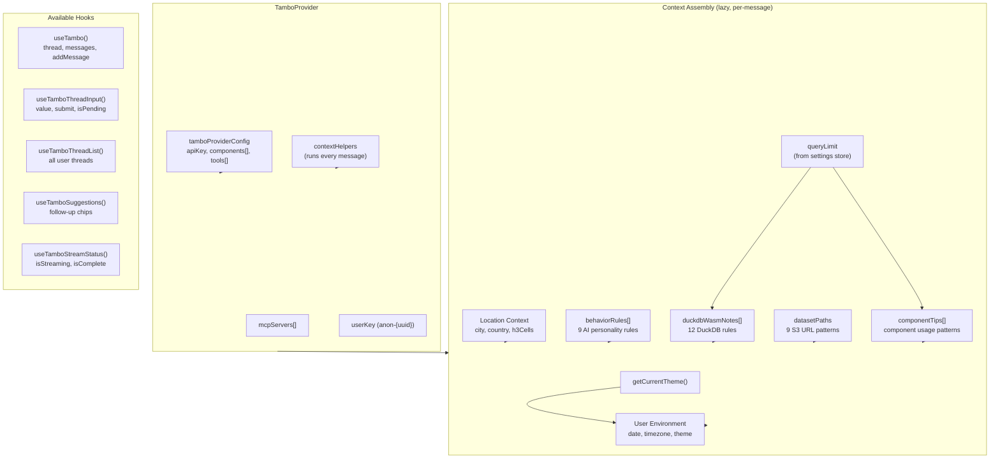
```mermaid
graph TB
    subgraph Provider["TamboProvider"]
        Config["tamboProviderConfig<br/>apiKey, components[], tools[]"]
        Context["contextHelpers<br/>(runs every message)"]
        MCPServers["mcpServers[]"]
        UserKey["userKey (anon-{uuid})"]
    end

    subgraph ContextHelpers["Context Assembly (lazy, per-message)"]
        Theme_C["getCurrentTheme()"]
        Env["User Environment<br/>date, timezone, theme"]
        Location["Location Context<br/>city, country, h3Cells"]
        Behavior["behaviorRules[]<br/>9 AI personality rules"]
        DDBNotes["duckdbWasmNotes[]<br/>12 DuckDB rules"]
        DSPaths["datasetPaths<br/>9 S3 URL patterns"]
        CompTips["componentTips[]<br/>component usage patterns"]
        QLim["queryLimit<br/>(from settings store)"]
    end

    Config --> Provider
    Context --> Provider
    Provider --> ContextHelpers
    Theme_C --> Env
    Env --> ContextHelpers
    Location --> ContextHelpers
    Behavior --> ContextHelpers
    DDBNotes --> ContextHelpers
    DSPaths --> ContextHelpers
    CompTips --> ContextHelpers
    QLim --> DDBNotes
    QLim --> CompTips

    subgraph Hooks["Available Hooks"]
        useTambo_H["useTambo()<br/>thread, messages, addMessage"]
        useInput["useTamboThreadInput()<br/>value, submit, isPending"]
        useThreadList["useTamboThreadList()<br/>all user threads"]
        useSuggestions_H["useTamboSuggestions()<br/>follow-up chips"]
        useStream["useTamboStreamStatus()<br/>isStreaming, isComplete"]
    end
```

### withTamboInteractable Flow

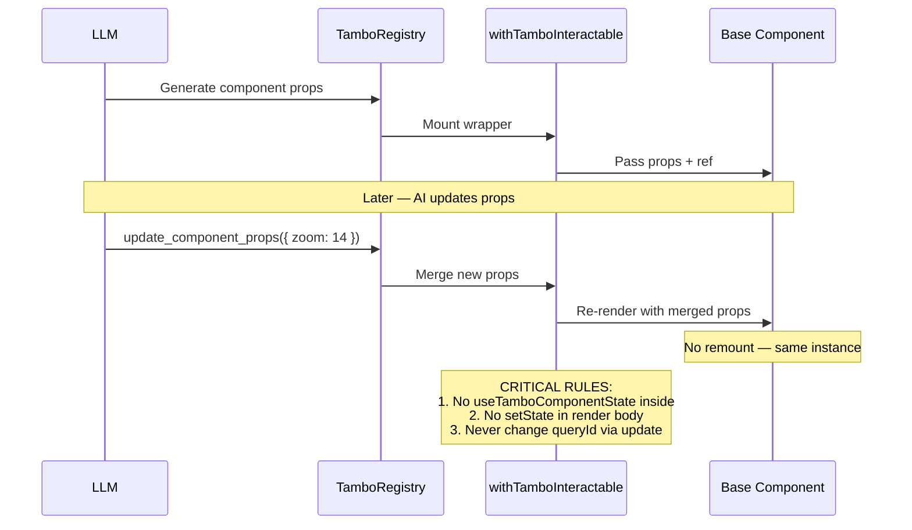
```mermaid
sequenceDiagram
    participant AI as LLM
    participant Registry as TamboRegistry
    participant WTI as withTamboInteractable
    participant Comp as Base Component

    AI->>Registry: Generate component props
    Registry->>WTI: Mount wrapper
    WTI->>Comp: Pass props + ref

    Note over AI,Comp: Later — AI updates props

    AI->>Registry: update_component_props({ zoom: 14 })
    Registry->>WTI: Merge new props
    WTI->>Comp: Re-render with merged props
    Note over Comp: No remount — same instance

    Note over WTI: CRITICAL RULES:<br/>1. No useTamboComponentState inside<br/>2. No setState in render body<br/>3. Never change queryId via update
```

---

## Data Services Architecture

```mermaid
graph TB
    subgraph Datasets["9 Datasets"]
        Weather["weather<br/>GraphCast AI forecast<br/>res 1-5, 24 cols"]
        Terrain["terrain<br/>GEDTM 30m DEM<br/>res 1-10, 6 cols"]
        Building["building<br/>Global Building Atlas<br/>res 3-8, 11 cols"]
        Population["population<br/>WorldPop SSP2<br/>res 1-8, 17 cols"]
        Places["places<br/>Overture POIs (72M)<br/>res 1-10, 31 cols"]
        Transport["transportation<br/>Overture (343M)<br/>res 1-10, 27 cols"]
        Base["base<br/>Overture environment<br/>res 1-10, 43 cols"]
        Addresses["addresses<br/>Overture<br/>res 1-10, 3 cols"]
        BldgOverture["buildings-overture<br/>Overture classification<br/>res 1-10, 42 cols"]
    end

    subgraph CrossIndices["11 Cross-Indices"]
        Walk["walkability<br/>5 signals, 4 datasets"]
        FMC["fifteen-min-city<br/>7 signals, 4 datasets"]
        Bio["biophilic<br/>base × population"]
        Heat["heat-vulnerability<br/>6 signals, 4 datasets"]
        Water["water-security<br/>6 signals, 5 datasets"]
        Urban["urban-density<br/>building + population"]
        Housing["housing-pressure<br/>population + building"]
        Land["landslide-risk<br/>terrain + building"]
        Vert["vertical-living<br/>building + population"]
        PopGrow["population-growth<br/>population only"]
        Shrink["shrinking-cities<br/>population only"]
    end

    subgraph Registry["Registry (index.ts)"]
        ListDS["listDatasets(category?)"]
        BuildURL["buildParquetUrl(dataset, h3Res)"]
        DescDS["describeDataset(dataset)"]
        GetCI["getCrossIndex(analysis)"]
    end

    Datasets --> Registry
    CrossIndices --> Registry
    Registry --> Tools[AI Tools]
```

### H3 Resolution Ranges

```mermaid
gantt
    title H3 Resolution Support by Dataset
    dateFormat X
    axisFormat %s

    section Weather
    res 1-5 :1, 5

    section Terrain
    res 1-10 :1, 10

    section Building
    res 3-8 :3, 8

    section Population
    res 1-8 :1, 8

    section Places
    res 1-10 :1, 10

    section Transportation
    res 1-10 :1, 10

    section Base
    res 1-10 :1, 10

    section Addresses
    res 1-10 :1, 10

    section Bldg-Overture
    res 1-10 :1, 10
```

**Cross-dataset join range: res 3–5** (shared by all datasets).

---

## Weather Forecast Workflow

```mermaid
flowchart TB
    subgraph Resolution["1. Resolve Latest Forecast"]
        GH[GitHub state file<br/>walkthru-weather-index/<br/>state/noaa-last-seen.txt]
        Parse["Parse: GRAP_v100_GFS_YYYYMMDDHH<br/>→ date + hour"]
        Fallback["Fallback: HEAD-probe<br/>7 recent dates × 2 hours"]
        GH -->|fetch| Parse
        Parse -->|fail| Fallback
    end

    subgraph Query["2. Query (3-step mandatory)"]
        Step0["Step 0: buildParquetUrl('weather')<br/>→ resolved URL"]
        Step1["Step 1: Timeline query<br/>Single cell, all 21 timestamps"]
        Step2["Step 2: Area query<br/>h3_grid_disk(center, radius),<br/>first timestamp only"]
    end

    subgraph Render["3. Render (mandatory components)"]
        RMap["GeoMap — area snapshot<br/>temperature/wind heatmap"]
        RGraph["Graph — 5-day timeline<br/>line chart (temp, precip, wind)"]
        RTable["DataTable — all timesteps<br/>detailed values"]
    end

    Resolution --> Step0
    Step0 --> Step1
    Step0 --> Step2
    Step1 --> RGraph
    Step1 --> RTable
    Step2 --> RMap
```

### Forecast File Structure

```
Each Parquet file = ONE forecast run:
├── 21 timestamps (6-hourly for 5 days)
├── All H3 cells at the chosen resolution
└── 24 weather variables per cell per timestamp

DO NOT build URLs for future dates — only the latest run exists.
Precip values can be negative (model artifact) — always GREATEST(val, 0).
```

---

## Cross-Index Analysis Workflow

```mermaid
flowchart TB
    subgraph Input["User Query"]
        NL["'How walkable is Amsterdam?'"]
    end

    subgraph Routing["suggestAnalysis()"]
        KW["Keyword matching<br/>'walkab' → walkability"]
        DS["Suggested datasets:<br/>transportation, base,<br/>terrain, places"]
        CI["Cross-index:<br/>walkability"]
    end

    subgraph Definition["getCrossIndex('walkability')"]
        Signals["5 Signals:<br/>road_ratio (35%)<br/>pedestrian_infra (15%)<br/>barrier_penalty (10%)<br/>slope_factor (15%)<br/>destination_density (25%)"]
        SQL_T["equivalentSQL:<br/>JOIN 4 datasets on h3_index<br/>at matching resolution"]
        Focus["focusRegion:<br/>Amsterdam (52.37, 4.9)"]
    end

    subgraph Execution["AI executes"]
        RunSQL_E["runSQL(equivalentSQL)"]
        Render_E["GeoMap + Graph + DataTable"]
    end

    NL --> KW
    KW --> DS
    KW --> CI
    CI --> Definition
    Definition --> Execution
```

---

## ArcGIS FeatureServer Workflow

```mermaid
sequenceDiagram
    participant AI as LLM
    participant Tool as describeArcGISLayer
    participant ArcGIS as ArcGIS Server
    participant DB as DuckDB-WASM
    participant Store as Query Store

    AI->>Tool: describeArcGISLayer({ url })

    Note over Tool: 1. Normalize URL<br/>Strip trailing /, append /0 if needed

    Tool->>ArcGIS: GET url?f=json (metadata)
    ArcGIS-->>Tool: { name, fields, geometryType, maxRecordCount }

    Tool->>ArcGIS: GET url/query?where=1=1&returnCountOnly=true&f=json
    ArcGIS-->>Tool: { count: 500 }

    Note over Tool: 2. Fetch GeoJSON<br/>Cap at min(count, 10000)<br/>Use %2A not * for outFields

    Tool->>ArcGIS: GET url/query?where=1=1&outFields=%2A&f=geojson&resultRecordCount=500
    ArcGIS-->>Tool: GeoJSON FeatureCollection

    Note over Tool: 3. Register in DuckDB-WASM<br/>registerRemoteJSON() →<br/>/remote/{hash}.geojson

    Tool->>DB: registerFileBuffer(geojsonBytes)
    DB-->>Tool: virtualPath

    Tool-->>AI: { name, columns, sampleSql, localPath }

    Note over AI: 4. AI runs the generated SQL

    AI->>DB: runSQL(sampleSql)
    Note over DB: read_json_auto(localPath)<br/>→ unnest(features)<br/>→ ST_GeomFromGeoJSON<br/>→ native GEOMETRY<br/>→ auto-detection → WKB
    DB-->>Store: Result with wkbArrays
    Store-->>AI: queryId

    AI->>AI: GeoMap(queryId) — auto-renders geometry
```

---

## Settings & Persistence

```mermaid
graph TB
    subgraph SettingsStore["settings-store.ts"]
        Theme_S["theme: dark | light | system"]
        QL["queryLimit: number<br/>default 10000<br/>presets: 500, 5K, 10K, 50K"]
        Persist["localStorage: walkthru-settings"]
    end

    subgraph LocalStorageKeys["All localStorage Keys"]
        LS1["walkthru-settings → theme + queryLimit"]
        LS2["walkthru-geoip → cached geo-IP (24h TTL)"]
        LS3["walkthru-user-key → anon-{uuid}"]
        LS4["panel-order-{threadId} → panel sort order"]
        LS5["panel-layouts-{threadId} → grid sizes (500ms debounce)"]
        LS6["panel-dismissed-{threadId} → closed panels"]
        LS7["geomap-viewport:{id} → zoom/pan/pitch/bearing"]
        LS8["geomap-layers:{ids} → opacity/visibility/order"]
        LS9["walkthru-mcp-servers → MCP server configs"]
    end

    subgraph Access["Access Patterns"]
        Read["readStorage(key, fallback)<br/>safe JSON parse"]
        Write["writeStorage(key, value)<br/>safe JSON stringify"]
        Hook["useSettings()<br/>useSyncExternalStore"]
    end

    SettingsStore --> Persist
    Persist --> LS1
    Access --> LocalStorageKeys
```

---

## Theme System

```mermaid
flowchart TB
    subgraph Detection["Theme Detection"]
        FOUC["index.html inline script<br/>reads localStorage BEFORE React<br/>removes .dark if light/system-light"]
        Boot["useThemeEffect()<br/>called once in App.tsx"]
        Setting["useSettings().theme<br/>dark | light | system"]
    end

    subgraph Application["Theme Application"]
        Dark["document.documentElement<br/>.classList.add('dark')"]
        Light["document.documentElement<br/>.classList.remove('dark')"]
        System["matchMedia('prefers-color-scheme')<br/>listener"]
    end

    subgraph CSS["CSS Variables (globals.css)"]
        LightVars["Light: --background: 0 0% 100%<br/>--foreground: 0 0% 3.9%<br/>--card, --muted, --border..."]
        DarkVars["Dark (.dark): --background: 0 0% 3.9%<br/>--foreground: 0 0% 98%<br/>--card, --muted, --border..."]
    end

    subgraph Map["Map Basemap"]
        Observer["MutationObserver<br/>watches .dark class"]
        CartoDark["CARTO Dark Matter"]
        CartoLight["CARTO Positron"]
    end

    FOUC --> Boot
    Setting -->|dark| Dark
    Setting -->|light| Light
    Setting -->|system| System
    System --> Dark
    System --> Light
    Dark --> DarkVars
    Light --> LightVars
    Observer --> CartoDark
    Observer --> CartoLight
```

---

## Mobile Architecture

```mermaid
flowchart TB
    subgraph Explore_Mobile["/explore on Mobile"]
        Header_M["Header: logo + settings gear"]
        Dashboard_M["DashboardCanvas<br/>(dnd-kit sortable)"]
        BottomSheet["MobileBottomSheet<br/>fixed bottom, swipeable"]

        subgraph Sheet["Bottom Sheet States"]
            Collapsed["Collapsed<br/>Input + suggestions visible<br/>sizes to content"]
            Expanded["Expanded<br/>top-0 (full screen)<br/>full message thread"]
        end
    end

    subgraph Gestures["Touch Gestures"]
        SwipeUp["Swipe up → expand"]
        SwipeDown["Swipe down → collapse"]
        Send["Send message → auto-expand"]
        CompRender["Component renders → auto-collapse"]
        DragPanel["Hold grip 1.2s → drag panel"]
    end

    Dashboard_M --> BottomSheet
    Collapsed --> SwipeUp
    Expanded --> SwipeDown
    Send --> Expanded
    CompRender --> Collapsed
```

---

## Geo-IP Personalization

```mermaid
flowchart TB
    subgraph Fetch["useGeoIP()"]
        Cache{"localStorage<br/>walkthru-geoip<br/>< 24h old?"}
        Cache -->|Yes| Cached[Return cached]
        Cache -->|No| API["fetch geojs.io/v1/ip/geo.json"]
        API --> H3Compute["h3-js: latLngToCell<br/>at res 1-8"]
        H3Compute --> Store_G["Cache in localStorage"]
        API -->|Blocked/Error| Null[Return null]
    end

    subgraph GeoIP_Data["GeoIP Object"]
        City["city: 'Cairo'"]
        Country["country: 'Egypt'"]
        LatLng["lat: 30.05, lng: 31.25"]
        TZ["timezone: 'Africa/Cairo'"]
        Cells["h3Cells: {<br/>  res1: '8128bffffffffff',<br/>  res2: '8228b9fffffffff',<br/>  ...<br/>  res8: '8828b90d5dfffff'<br/>}"]
    end

    subgraph Usage["How It's Used"]
        Suggestions_U["10 geo-personalized<br/>suggestion chips"]
        Context_U["AI context:<br/>user location + H3 cells"]
        SQL_U["Pre-computed cells<br/>for instant queries"]
    end

    Store_G --> GeoIP_Data
    GeoIP_Data --> Suggestions_U
    GeoIP_Data --> Context_U
    GeoIP_Data --> SQL_U
```

---

## Error Recovery

```mermaid
flowchart TB
    subgraph QueryErrors["DuckDB Query Errors"]
        GeomArrow["GEOMETRY Arrow<br/>serialization crash"]
        GeomArrow -->|"Retry"| WKBFallback["Convert all GEOMETRY<br/>to WKB via ST_AsWKB"]

        OOM["Out of Memory<br/>(~3GB WASM limit)"]
        OOM -->|"Prevention"| PushWhere["Push WHERE into<br/>Parquet scan<br/>Lower resolution"]
    end

    subgraph ThreadErrors["Thread Errors"]
        InvalidRun["invalid_previous_run<br/>error"]
        InvalidRun -->|"Auto-recovery"| NewThread["startNewThread()<br/>preserves user text"]
    end

    subgraph MapErrors["Map Errors"]
        StyleUndef["this.style is undefined<br/>(MapLibre race)"]
        StyleUndef -->|"try/catch"| Retry_M["Retry on next<br/>theme change"]

        NaNColor["valueToColor NaN<br/>(stops[lo] undefined)"]
        NaNColor -->|"Guard"| Midpoint["Fall back to<br/>midpoint color"]
    end

    subgraph NetworkErrors["Network"]
        GeoIPFail["Geo-IP blocked"]
        GeoIPFail --> NullGeo["Return null<br/>global suggestions"]

        WeatherURL["Weather date 404"]
        WeatherURL --> HEADProbe["HEAD-probe cascade<br/>7 dates × 2 hours"]
    end
```

---

## Key Design Decisions

| Decision | Why |
|----------|-----|
| **queryId pattern** | LLM context is expensive. Passing ~10 tokens instead of 10K rows saves cost and latency |
| **DuckDB-WASM** | Full SQL engine in browser = no backend, instant queries, privacy (data never leaves browser) |
| **GeoArrow zero-copy** | Typed arrays from DuckDB → GPU buffers with no JS intermediary = 60fps map rendering |
| **H3/A5 grid indexing** | All datasets share h3_index = trivial cross-dataset joins at any resolution |
| **Geometry auto-detection** | Users just write `SELECT *` — system handles WKB extraction, centroid injection, and map rendering |
| **CSS variables for theming** | Single source of truth for colors. No `dark:` variants needed in component code |
| **readStorage/writeStorage** | Centralized error handling. Pure SPA = no SSR guards needed |
| **All panels full-width** | Simpler layout, better readability. Maps get 640px height, charts/tables get 400px |
| **Maps float to top** | Most important visualization = most prominent position. Automatic, no AI coordination needed |
