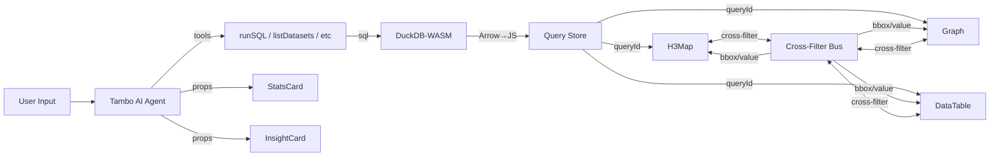

# CLAUDE.md

## Project: Walkthru Earth AI

AI-powered urban intelligence platform. Users talk to global geospatial data (weather, terrain, buildings, population) via natural language. Built on **Tambo AI** + **DuckDB-WASM** + **deck.gl**.



### Companion Project
`../walkthru-earth.github.io/` — deck.gl + hyparquet for client-side Parquet rendering on a 3D globe.

## Essential Commands

```bash
# Package manager: pnpm (NOT npm)
pnpm dev             # localhost:3000
pnpm build           # Production build
pnpm lint            # ESLint (config has a known circular ref issue)
```

## Core Architecture

### Zero-Token Data Bridge (queryId pattern)
The central optimization. AI calls `runSQL` → DuckDB executes → full result stored client-side in `query-store.ts`. Only `queryId` + metadata returned to LLM (~10 tokens). Components read data directly from store.

**Components using queryId**: H3Map, Graph, DataTable
**Components using inline props**: StatsCard, StatsGrid, InsightCard, DatasetCard, QueryDisplay

### Cross-Filter Bus
Lightweight pub/sub in `query-store.ts` (no Zustand). Components emit/consume filters:
- **bbox**: Map viewport change → h3-js computes visible hex IDs → Graph/DataTable filter to matching rows
- **value**: Click bar/row/hex → highlights in other components
- **Toggle**: Link icon in explore header enables/disables globally
- Requires shared `queryId` + `hex` column across linked components

### DuckDB-WASM
In-browser SQL engine. Preloaded on page mount. Extensions: httpfs (S3 access), h3 (hex functions). Retries up to 3x on chunk load failure.

**Critical DuckDB rules (for AI tool descriptions)**:
- `h3_cell_to_latlng()` returns `DOUBLE[2]` list, NOT a struct — never use `.lat`
- Use `h3_grid_ring` not `h3_k_ring` (deprecated)
- `h3_cell_area(h3_index, 'km^2')` not `h3_cell_area_km2`
- ONE statement per call, always LIMIT 500, HTTPS URLs in FROM

### Dashboard Canvas
`DashboardCanvas` uses `useMemo` (not useEffect+state) to derive panels from Tambo messages — ensures streamed prop updates always reflect. Panels are draggable/resizable via react-grid-layout (desktop only — disabled on touch devices). `data-canvas-space="true"` attribute tells chat sidebar to show "Rendered in dashboard" instead of inline component.

Panel dragging: only via `.panel-drag-handle` grip icon (hidden on touch). Content area has `.panel-content` class with `draggableCancel` to prevent grid drag conflicts with map panning.

**Component sizing**: All viz components use `h-full flex flex-col` to fill their panel. No fixed pixel heights — the panel controls size, header/footer use `flex-shrink-0`, content uses `flex-1 min-h-0`.

**Mobile**: Separate `sm` layout (single column, shorter panels, tighter margins). Chat is a collapsible bottom sheet, dashboard fills the screen.

## Data Infrastructure

| Dataset | S3 Path | H3 Res | Columns |
|---------|---------|--------|---------|
| Weather (GraphCast) | `indices/weather/model=GraphCast_GFS/date={date}/hour={hour}/h3_res=5/` | 5 only | h3_index, timestamp, temperature_2m_C, wind_speed_10m_ms, wind_direction_10m_deg, pressure_msl_hPa, precipitation_mm_6hr |
| Terrain (GEDTM 30m) | `dem-terrain/v2/h3/h3_res={1-10}/` | 1-10 | h3_index, elev, slope, aspect, tri |
| Buildings (2.75B) | `indices/building/v2/h3/h3_res={3-8}/` | 3-8 | h3_index, building_count, building_density, avg_height_m, total_volume_m3, total_footprint_m2, avg_footprint_m2, coverage_ratio |
| Population (SSP2) | `indices/population/v2/scenario=SSP2/h3_res={1-8}/` | 1-8 | h3_index, pop_2025, pop_2050, pop_2100 |

S3 base: `https://s3.us-west-2.amazonaws.com/us-west-2.opendata.source.coop/walkthru-earth`

## When Working on This Codebase

### Adding a queryId-driven component
1. Define Zod schema with `queryId`, column-mapping fields, plus `.describe()` on every field
2. In component: `useQueryResult(queryId)` (reactive hook) → derive display data from rows. **Not** `getQueryResult()` — that's synchronous and won't re-render when thread replay populates data asynchronously.
3. Consume `useCrossFilter()` for highlighting, emit `setCrossFilter()` on click
4. Register in `src/lib/tambo.ts` with description telling AI to prefer queryId mode

### Adding a new tool
1. Implement in `src/services/`
2. Define Zod input/output schemas
3. Register in `src/lib/tambo.ts` tools array
4. Add usage rules to tool description (AI reads these)

### Zod constraints (Tambo rejects invalid schemas)
- No `z.record()`, `z.map()`, `z.set()` — use `z.object()` with explicit keys
- Array items need `id` field for React keys
- Always `.describe()` every field

### Styling
- Tailwind CSS v4, dark/light mode via CSS variables
- Brand colors: `earth-blue` (hsl 204 80% 40%), `earth-cyan` (hsl 185 72% 48%), `earth-green` (hsl 158 64% 52%) — defined in `@theme inline` in globals.css
- Font: Quicksand (local woff2), forced via `font-family: inherit` on `*`
- Components: `forwardRef` + handle undefined props for streaming
- **No hardcoded colors**: Never use `bg-zinc-950`, `text-zinc-200`, `hsl(...)` inline, `#hex`, or `rgb()`. Use theme variables: `bg-muted`, `text-foreground`, `bg-card`, `text-primary`, `var(--border)`, etc.
- **No `!important`**: All styles must be native — use JS conditionals instead of CSS overrides
- Use semantic color classes: `text-destructive` not `text-red-500`, `text-primary` not `text-blue-500`, `bg-destructive/10` not `bg-red-50`

### Theme
- **System detection**: On first visit (no localStorage), detects `prefers-color-scheme`. Inline `<script>` in layout.tsx prevents FOUC.
- **ThemeSwitcher**: Dark/Light/System cycle on both homepage and /explore. Persists to localStorage.
- **Map basemap**: Reactive — CARTO Dark Matter (dark) / CARTO Positron (light). `MutationObserver` watches `<html>` class changes.
- **RTL text plugin**: Loaded once for Arabic/Hebrew map labels.
- **All pages** must use theme-aware CSS variables (`bg-background`, `text-foreground`, etc.), never hardcoded colors.

### Tambo internal props
Components receive `_tambo_*` props from Tambo SDK. Never spread `{...props}` onto DOM elements — destructure known props only.

### Thread URLs
- URL param `?thread=threadId` only set for real thread IDs (prefix `thr_`), never for `placeholder`.
- On shared link load: validates thread ID, switches thread, replays SQL queries.

### No user-visible branding
Never show "Tambo", "DuckDB", "H3", "Parquet", "deck.gl" etc. in the UI. These are internal implementation details. Use generic terms like "interactive maps" and "real-time queries".

## Tambo CLI

```bash
npx tambo add <component>    # Add UI components
npx tambo init               # Re-initialize API key
```

Docs: https://docs.tambo.co/llms.txt

## CLAUDE.md Maintenance

**Always update CLAUDE.md files when you change the codebase.** There are 5 CLAUDE.md files:

| File | Scope |
|------|-------|
| `CLAUDE.md` (root) | Architecture, commands, data infra, conventions |
| `src/app/CLAUDE.md` | Pages, layout, theme, thread URLs |
| `src/services/CLAUDE.md` | DuckDB, query store, cross-filter, datasets |
| `src/components/tambo/CLAUDE.md` | Viz components, dashboard, chat UI |
| `src/lib/CLAUDE.md` | Tambo config, tools, component registry |

After making code changes, check if any CLAUDE.md needs updating. Focus on: new exports, changed behavior, new patterns, removed features.
