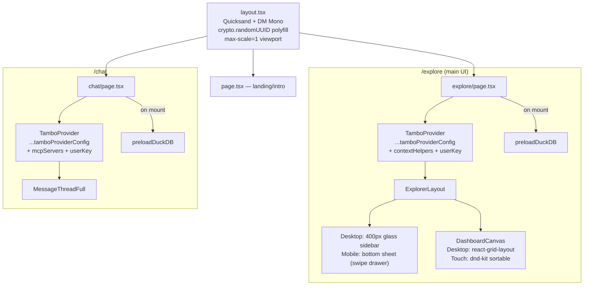

# src/app/

Next.js App Router pages.

## Files

### `layout.tsx`
Root layout. Loads Quicksand (local woff2 variable font) + DM Mono (Google). Sets `dark` class on `<html>`. Inline `<script>` does:
- Theme detection (prevents FOUC)
- `crypto.randomUUID` polyfill for older iOS/Android WebViews
- `<meta name="viewport" ... maximum-scale=1>` prevents iOS input zoom

### `globals.css`
- Tailwind v4 theme: CSS variables for light + dark modes
- Brand colors: `earth-blue`, `earth-cyan`, `earth-green` in `@theme inline`
- Glass panels, scrollbar styling, animations
- Dashboard grid: `.react-grid-item { touch-action: auto }`, `.panel-drag-handle { touch-action: none }`, `.panel-content { touch-action: auto }`

### `explore/page.tsx`
Main dashboard page. Uses `tamboProviderConfig` (spread from `tambo.ts`) + `contextHelpers` + `userKey`.

**Key features:**
- **TamboProvider**: `autoGenerateThreadName: true` (from shared config) — threads auto-named after 2 messages
- **contextHelpers**: behavior rules, DuckDB notes, S3 paths, component tips
- **MobileBottomSheet**: Swipeable drawer with drag handle pill. 2 states: collapsed (input bar) / expanded (full chat). Swipe up/down or tap pill to toggle.
- **Auto-expand**: Mobile chat expands when user sends a message
- **Auto-collapse**: Collapses when AI renders a dashboard component
- **SessionHistory**: Thread list with auto-generated names, new thread button. Available in both desktop sidebar and mobile expanded header.
- **CrossFilterToggle**: Link2/Link2Off, calls `useCrossFilterEnabled()`
- **ThemeSwitcher**: Dark/Light/System cycle. Mobile: floats in top-right pill when collapsed.
- **Query replay**: Replays `runSQL` tool calls from restored threads to repopulate query store.
- **Thread URLs**: `?thread=threadId` — validates `thr_` prefix, syncs with Tambo.

### `page.tsx` (homepage)
Landing page. No user-visible tech branding.

### `chat/page.tsx`
Chat page with `MessageThreadFull`. Uses `tamboProviderConfig` + `mcpServers` + `userKey`. Components render inline (no dashboard canvas).

### `fonts.ts`
Quicksand variable font config. Weight range 300-700.
