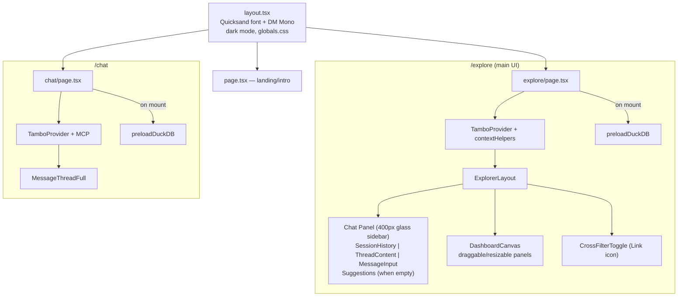

# src/app/

Next.js App Router pages.

## Files

### `layout.tsx`
Root layout. Loads Quicksand (local woff2 variable font) + DM Mono (Google). Sets `dark` class on `<html>`. Inline `<script>` detects system theme preference on first visit (no localStorage) and removes `dark` class if user prefers light — prevents flash of wrong theme.

### `globals.css`
- Tailwind v4 theme: CSS variables for light + dark modes, `--font-sans` → Quicksand, `--font-mono` → DM Mono
- Brand colors: `earth-blue`, `earth-cyan`, `earth-green` defined in `@theme inline` block
- `*, *::before, *::after { font-family: inherit }` forces Quicksand everywhere
- Body: 17px, font-weight 500
- Glass panels: `backdrop-filter: blur(24px)` — separate light/dark variants
- Scrollbar: theme-aware (dark thumb on light bg, light thumb on dark bg)
- Dashboard grid: placeholder, resize handle styling
- Animations: flash, thinking-gradient, fade-up

### `explore/page.tsx`
Main dashboard page. Key features:
- **contextHelpers.behavior**: Tells AI to be decisive, not ask clarifying questions
- **contextHelpers.duckdbWasmNotes**: DuckDB rules for AI
- **contextHelpers.componentTips**: Instructs AI to use same queryId for linked components
- **CrossFilterToggle**: Link2/Link2Off icon, calls `useCrossFilterEnabled()`
- **SessionHistory**: Shows threads with `threadLabel()` (date + truncated ID, not "Untitled")
- **Suggestions**: 3 starter suggestions shown when thread is empty
- **DuckDB preload**: `preloadDuckDB()` on mount
- **Shareable thread URLs**: `?thread=threadId` in URL. Only real `thr_`-prefixed IDs written to URL (never `placeholder`). On load, validates and calls `switchThread(urlThread)`. Invalid params cleaned from URL. Share button in session history copies link.
- **Query replay**: When a thread loads from URL, scans messages for `tool_use` blocks with `runSQL`, extracts SQL from `tool_use.input.sql`, finds the matching `tool_result` across ALL messages (tool_use and tool_result are in DIFFERENT messages — assistant vs user/tool), extracts the original `queryId` from the tool_result JSON, re-executes the SQL via DuckDB-WASM in-browser, and stores the result under the original `queryId` via `storeQueryResultWithId()`. Components use the reactive `useQueryResult()` hook so they automatically re-render when the async replay completes.
- **ThemeSwitcher**: Dark/Light/System cycle. Always starts "dark" to match server render, syncs from localStorage in effect (prevents hydration mismatch).
- **No emojis**: All icons are Lucide components. Logo is `WalkthruLogo` (next/image from `/walkthru-icon.svg`).

### `page.tsx` (homepage)
Landing page with hero, CTA buttons, dataset grid, analyses, how-it-works. Includes its own ThemeSwitcher + WalkthruLogo navbar. No user-visible tech branding (no "DuckDB", "Tambo", "H3" etc.).

### `chat/page.tsx`
Chat page with `MessageThreadFull`. No dashboard canvas → components render inline. Uses `WalkthruLogo` in header.

### `fonts.ts`
Quicksand variable font config. Weight range 300-700.
