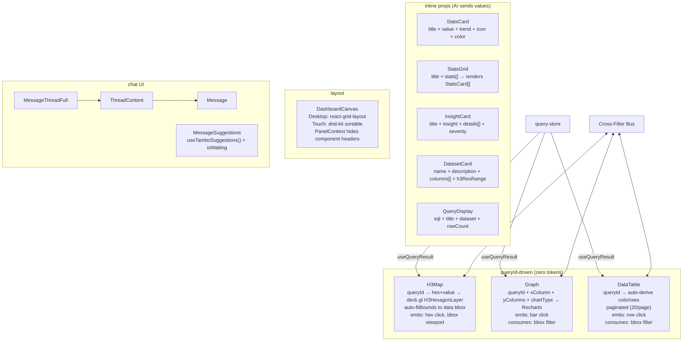

# src/components/tambo/

AI-controlled visualization components + chat UI.

## Viz Components (queryId pattern)

All three queryId components use `useQueryResult(queryId)` (reactive hook from query-store) — NOT `getQueryResult()`. Components check `useInDashboardPanel()` from `PanelContext` to hide their own headers when rendered inside dashboard panels (the panel provides a unified header bar).

### `h3-map.tsx` + `h3-map-deckgl.tsx`
| Prop | Type | Description |
|------|------|-------------|
| queryId | string | Reads hex+value from query store |
| hexColumn | string | Column name for H3 hex string (default: "hex") |
| valueColumn | string | Column name for numeric value (default: "value") |
| latitude/longitude/zoom | number | Fallback center (overridden by auto-fitBounds) |
| colorMetric | string | Legend label |
| colorScheme | enum | blue-red, viridis, plasma, warm, cool, spectral |
| extruded | boolean | 3D extrusion |

- **DeckGLMap init**: Map creates ONCE (empty deps). Separate effects for layers, theme, fitBounds, flyTo.
- **Auto-fitBounds**: When hex data arrives, computes bounding box via `h3-js cellToLatLng` and calls `map.fitBounds()` with padding. `latitude`/`longitude`/`zoom` props only used as fallback if fitBounds hasn't run.
- **Theme-reactive basemap**: `useIsDark()` via `MutationObserver`. Dark → CARTO Dark Matter, Light → CARTO Positron.
- **RTL text plugin**: Loaded once for Arabic/Hebrew labels.
- **Cross-filter**: `onHexClick` → value filter, `onBoundsChange` → bbox filter via h3-js.
- **Compact header/legend**: Hidden when `inPanel` (PanelContext). Legend uses `text-xs`, `h-2` gradient bar.

### `graph.tsx`
- Cross-filter consume/emit. Checks `useInDashboardPanel()` to hide title when in panel.

### `data-table.tsx`
- **Paginated**: 20 rows per page with prev/next controls, row range display.
- **Sticky header**, compact cells (`px-3 py-1.5`, `text-xs`).
- Cross-filter consume/emit. Checks `useInDashboardPanel()` to hide title.

## Dashboard

### `panel-context.tsx`
`PanelContext` (boolean context) + `useInDashboardPanel()` hook. When `true`, components hide their own header/chrome — the dashboard panel provides a unified header instead.

### `dashboard-canvas.tsx`
- **Merged panel header**: Single bar with `[grip] [title] ... [maximize] [close]`. Title read from `content.props.title` (Tambo content block), fallback to formatted componentName.
- **Panel ID deduplication**: Uses `Set<string>` to ensure unique panel IDs. `content.id` can collide across components in the same message — dedup appends `compIdx` suffix when needed.
- **Desktop**: `react-grid-layout` with `draggableHandle: ".panel-drag-handle"`. Maps 8 rows (640px), graphs 5, tables 4.
- **Touch/mobile**: `@dnd-kit/core` + `@dnd-kit/sortable` with `TouchSensor` (1.2s delay, 8px tolerance). Only the grip icon is the drag activator (`setActivatorNodeRef`). Content area (maps, charts) is fully interactive.
- **During drag**: WebGL content hidden ("Moving..." placeholder) to avoid context errors.
- **Panel order**: Persisted to `localStorage` per thread (`panel-order-${threadId}`).
- **Auto-scroll**: Scrolls to latest panel when new components appear.
- `data-canvas-space="true"` triggers chat to show "Rendered in dashboard".

### `message-suggestions.tsx`
- Uses `useTamboSuggestions()` (SDK built-in) for auto-generated follow-up suggestions.
- Shows `MessageGenerationStage` during both `isStreaming` AND `isWaiting` phases.
- Pre-seeded `initialSuggestions` shown only when thread is empty.

## Component sizing

All queryId components use `h-full flex flex-col` to fill their dashboard panel:
- **Header/Legend/Footer**: `flex-shrink-0`
- **Content area**: `flex-1 min-h-0`, scrolls internally
- **Map canvas**: `min-h-[200px]` ensures visibility
- **Loading states**: `h-full min-h-[200px]`

## Chat UI

### `message-input.tsx`
- **Plain textarea only** — TipTap rich-text editor was removed entirely (no `text-editor.tsx`). All text input uses native `<textarea>`.
- **Types defined inline**: `ImageItems`, `getImageItems()`, `TamboEditor`, `ResourceItem`, `PromptItem` — moved from deleted `text-editor.tsx`.
- **Submit error recovery**: Detects `invalid_previous_run` errors (SDK run ID desync) and auto-calls `startNewThread()` to escape the error loop. User's text is preserved in the input for resend.
- **Compound component**: `MessageInput`, `MessageInput.Textarea`, `MessageInput.SubmitButton`, `MessageInput.Toolbar`, etc.
- **No TipTap dependencies**: All `@tiptap/*` packages and `use-debounce` have been removed from the project.

### `message.tsx`
- **MessageRenderedComponentArea**: Checks `[data-canvas-space="true"]` in DOM. If found → "Rendered in dashboard". If not → renders inline.

### `thread-content.tsx`
Renders message list. `isGenerating = !isIdle` (covers both `isWaiting` and `isStreaming`).
