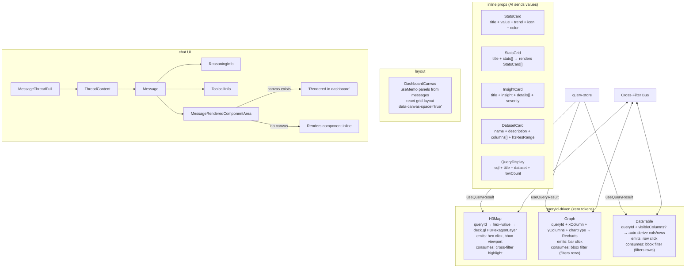

# src/components/tambo/

AI-controlled visualization components + chat UI.

## Viz Components (queryId pattern)

All three queryId components use `useQueryResult(queryId)` (reactive hook from query-store) — NOT `getQueryResult()`. This is critical: thread replay re-runs SQL asynchronously, and the reactive hook ensures components re-render when data becomes available.

### `h3-map.tsx` + `h3-map-deckgl.tsx`
| Prop | Type | Description |
|------|------|-------------|
| queryId | string | Reads hex+value from query store |
| hexColumn | string | Column name for H3 hex string (default: "hex") |
| valueColumn | string | Column name for numeric value (default: "value") |
| latitude/longitude/zoom | number | Map center |
| colorMetric | string | Legend label |
| colorScheme | enum | blue-red, viridis, plasma, warm, cool, spectral |
| extruded | boolean | 3D extrusion |

- **DeckGLMap**: MapLibre + deck.gl overlay. H3HexagonLayer + ScatterplotLayer.
- **Theme-reactive basemap**: `useIsDark()` hook watches `<html>` class via `MutationObserver`. Dark → CARTO Dark Matter, Light → CARTO Positron. Style switch calls `map.setStyle()` + re-attaches deck.gl overlay on `styledata` event.
- **RTL text plugin**: Loaded once via `ensureRTLPlugin()` before map init for Arabic/Hebrew labels.
- **Cross-filter emit**: `onHexClick` → `setCrossFilter(value)`, `onBoundsChange` → h3-js `cellToLatLng` → visible hex IDs → `setCrossFilter(bbox)`.
- **Map drag isolation**: `onPointerDown/onMouseDown stopPropagation`, `draggableCancel: ".panel-content"`.

### `graph.tsx`
| Prop | Type | Description |
|------|------|-------------|
| queryId | string | Reads data from query store (preferred) |
| xColumn | string | Column for X-axis labels |
| yColumns | string[] | Columns for Y-axis series |
| chartType | enum | bar, line, pie |
| data | object | LEGACY inline data (deprecated) |

- **Cross-filter consume**: bbox filter → filters rows to visible hexes before building chart data.
- **Cross-filter emit**: bar click → `setCrossFilter(value)`.
- **No `{...props}` spread** — Tambo `_tambo_*` props must not reach DOM.

### `data-table.tsx`
| Prop | Type | Description |
|------|------|-------------|
| queryId | string | Auto-derives columns + rows from store (preferred) |
| visibleColumns | string[] | Optional subset of columns to show |
| columns/rows | object[] | LEGACY inline data |

- **Cross-filter consume**: bbox → filters rows; value → highlights matching rows with `bg-primary/10`.
- **Cross-filter emit**: row click → `setCrossFilter(value)`.
- **formatCell()**: Numbers get `toLocaleString()`, handles null.

## Inline Components

### `stats-card.tsx`
Single metric card. Props: title, value (string), subtitle, change (%), trend (up/down/flat), icon (emoji enum), color (accent).

### `stats-grid.tsx`
Renders array of StatsCard. Reuses `statsCardSchema.extend({id})`.

### `insight-card.tsx`
Key finding card. Props: title, insight text, details[] (label+value pairs), severity (info/warning/critical/positive), region, datasets[], sql (collapsible). **Safety**: `SEVERITY_STYLES[severity] ?? SEVERITY_STYLES.info` fallback for undefined during streaming.

### `dataset-card.tsx`
Dataset metadata. Props: name, description, category, columns[] (name+description), h3ResRange, totalRows, sourceUrl.

### `query-display.tsx`
SQL syntax-highlighted display with copy button. Props: sql, title, dataset, parquetUrl, rowCount, duration.

## Component sizing

All queryId components use `h-full flex flex-col` to fill their dashboard panel. Fixed heights are avoided — the panel controls size, components fill with flex:
- **Header/Legend/Footer**: `flex-shrink-0` — always visible, never clipped
- **Content area** (map, chart, table body): `flex-1 min-h-0` — fills remaining space, scrolls internally
- **Graph**: Uses `min-h-[16rem]` (not fixed `h-64`) so it has a floor but can grow
- **Loading states**: `h-full min-h-[200px]` — fills panel, has a minimum

## Dashboard

### `dashboard-canvas.tsx`
- `useMemo` (not useEffect+state) derives panels from `messages.content[].renderedComponent` — always reflects latest streamed props.
- `dismissedIds` Set for panel removal (not `seenIdsRef`).
- **Panel header**: Ultra-compact (~20px) — grip icon, maximize, close. Subtle `bg-muted/10` background.
- **Maximized view**: Edge-to-edge component, minimal top bar (~24px) showing panel count + minimize button.
- `data-canvas-space="true"` triggers chat to show "Rendered in dashboard" label.
- Grid config: `draggableHandle: ".panel-drag-handle"`, `draggableCancel: ".panel-content"`.

**Responsive layouts** (separate per breakpoint, NOT shared):
- **lg (>900px)**: 12 cols. Maps full-width (w=12), others 2-col (w=6). rowHeight=80, margin=12.
- **md (600-900px)**: 8 cols. Maps full-width (w=8), others 2-col (w=4).
- **sm (<600px)**: 4 cols. All full-width (w=4). rowHeight=70, margin=8, padding=8. Shorter panel heights (Map=4, Graph=3). Bottom padding `pb-[240px]` for mobile chat sheet.

**Touch devices**: `useIsTouchDevice()` hook detects `pointer: coarse`. Disables `isDraggable` and `isResizable`. Hides drag grip icon. No `!important` CSS — all native JS.

## Chat UI

### `message.tsx`
- **ReasoningInfo**: Collapsible thinking section. `text-sm opacity-90`, content `text-sm text-foreground/80`.
- **MessageRenderedComponentArea**: Checks `[data-canvas-space="true"]` in DOM. If found → shows "Rendered in dashboard". If not → renders inline.
- **ToolcallInfo**: Collapsible tool call display.

### `thread-content.tsx`
Renders message list. Applies `font-sans` class. Filters system messages. Component blocks rendered via `MessageRenderedComponentArea`.
