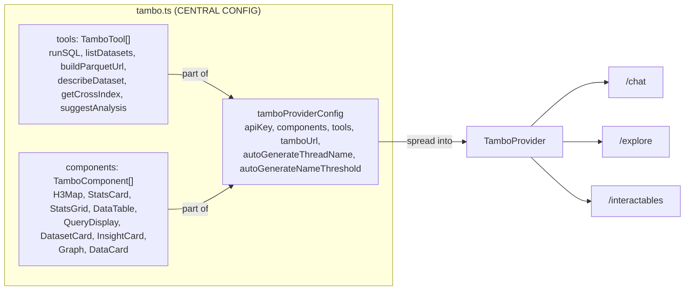

# src/lib/

Central configuration, utilities, and shared provider config.

## Files

### `tambo.ts`
Central registration file. All 3 pages import from here.

**`tamboProviderConfig`** — shared base props for all `TamboProvider` instances:
- `apiKey`, `components`, `tools`, `tamboUrl`
- `autoGenerateThreadName: true` — SDK auto-names threads after 2 messages
- `autoGenerateNameThreshold: 2`
- Pages spread this config and add page-specific overrides (`contextHelpers`, `mcpServers`, `userKey`)

**Tools** (6 total):
| Tool | Input | Output | Key Rules in Description |
|------|-------|--------|------------------------|
| runSQL | `{sql}` | `{queryId, columns, rowCount, duration, sampleRows}` | No INSTALL/LOAD, LIMIT 500, h3_cell_to_latlng returns DOUBLE[2] not struct, h3_grid_ring not h3_k_ring |
| listDatasets | `{category?}` | `DatasetInfo[]` | |
| buildParquetUrl | `{dataset, h3Res?}` | `{url, h3Res, sql}` | |
| describeDataset | `{dataset}` | `DatasetDescription` | |
| getCrossIndex | `{analysis: enum}` | `CrossIndexOutput` | 6 analyses available |
| suggestAnalysis | `{question}` | `AnalysisSuggestion` | |

**Components** (9 total):
- queryId-driven: H3Map, Graph, DataTable (descriptions tell AI to prefer queryId)
- Inline: StatsCard, StatsGrid, InsightCard, DatasetCard, QueryDisplay, DataCard

### `thread-hooks.ts`
Custom hook `useMergeRefs` — combines multiple refs into one (used by MessageThreadFull).

### `use-anonymous-user-key.ts`
Generates persistent anonymous user key for Tambo sessions (localStorage key: `walkthru-user-key`). The SDK requires `userKey` for thread scoping but doesn't auto-generate one — this hook fills that gap. Uses `crypto.randomUUID()` with fallback for older browsers.

### `utils.ts`
- `cn()` — Tailwind class merger (clsx + tailwind-merge)
- `basePath` — `NEXT_PUBLIC_BASE_PATH || "/ai"` for static asset URLs in static export
