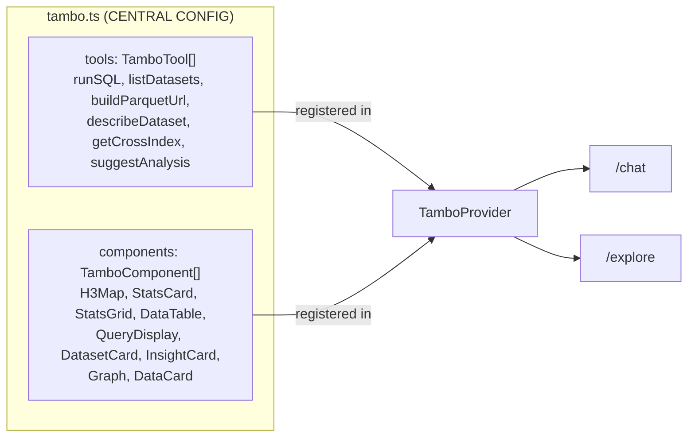

# src/lib/

Central configuration and utilities.

## Files

### `tambo.ts`
Central registration file. Imported by both `/chat` and `/explore` pages.

**Tools** (6 total):
| Tool | Input | Output | Key Rules in Description |
|------|-------|--------|------------------------|
| runSQL | `{sql}` | `{queryId, columns, rowCount, duration, sampleRows}` | No INSTALL/LOAD, LIMIT 500, h3_cell_to_latlng returns DOUBLE[2] not struct, h3_grid_ring not h3_k_ring |
| listDatasets | `{category?}` | `DatasetInfo[]` | |
| buildParquetUrl | `{dataset, h3Res?}` | `{url, h3Res, sql}` | |
| describeDataset | `{dataset}` | `DatasetDescription` | |
| getCrossIndex | `{analysis: enum}` | `CrossIndexOutput` | 6 analyses available |
| suggestAnalysis | `{question}` | `AnalysisSuggestion` | |

**Components** (9 total):
- queryId-driven: H3Map, Graph, DataTable (descriptions tell AI to prefer queryId)
- Inline: StatsCard, StatsGrid, InsightCard, DatasetCard, QueryDisplay, DataCard

### `thread-hooks.ts`
Custom hook `useMergeRefs` — combines multiple refs into one (used by MessageThreadFull).

### `use-anonymous-user-key.ts`
Generates persistent anonymous user key for Tambo sessions (localStorage).

### `utils.ts`
`cn()` — Tailwind class merger (clsx + tailwind-merge).
