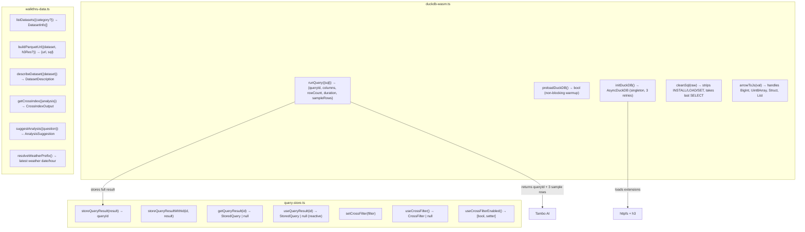

# src/services/

Data layer — DuckDB execution, query caching, dataset catalog.

## Files

### `duckdb-wasm.ts`
- **initDuckDB()**: Singleton init. Loads via jsDelivr bundles, Blob URL worker. Extensions: httpfs, h3. Retries 3x with backoff.
- **preloadDuckDB()**: Non-blocking warmup, called on page mount.
- **runQuery(input)**: Cleans SQL → executes → Arrow→JS conversion → stores in query-store → returns metadata + 3 sample rows to LLM.
- **cleanSql(raw)**: Strips INSTALL/LOAD/SET statements, takes last SELECT.
- **arrowToJs(val)**: Converts Arrow types: BigInt→Number, Uint8Array→hex string, Struct→.toJSON(), Array→recursive.

### `query-store.ts`
- **Query Store**: `Map<string, StoredQuery>`. Keeps last 20 results. `storeQueryResult()` returns auto-incremented `qr_N` ID. `storeQueryResultWithId(id, result)` stores under a specific ID (used for thread replay/restore). Both write functions emit to subscribers via `emitQuery()`.
- **Reactive hook**: `useQueryResult(queryId)` — `useSyncExternalStore`-based. Re-renders when any query is stored. Components MUST use this instead of `getQueryResult()` to support async thread replay (SQL re-runs in background → store populates → components re-render).
- **Cross-Filter Bus**: `setCrossFilter()` / `getCrossFilter()` / `clearCrossFilter()`. Single active filter. Types: `value` (click), `bbox` (map viewport). `useSyncExternalStore` for React binding.
- **Toggle**: `setCrossFilterEnabled(bool)` / `useCrossFilterEnabled()`. When disabled, `setCrossFilter()` is a no-op.

### `walkthru-data.ts`
- **DATASETS**: Array of 4 dataset definitions (weather, terrain, building, population) with columns, URL patterns, H3 res ranges.
- **CROSS_INDICES**: 6 pre-built cross-dataset analyses with sample SQL and focus regions.
- **resolveWeatherPrefix()**: Probes S3 for latest available weather date/hour (cached).
- **suggestAnalysis()**: Keyword-based routing → suggests datasets, cross-indices, sample SQL for a natural language question.
